# **Week 6 Lab Report 3**

---

## Streamlining ssh Configuration

I used vim to edit my `.ssh/config` file.

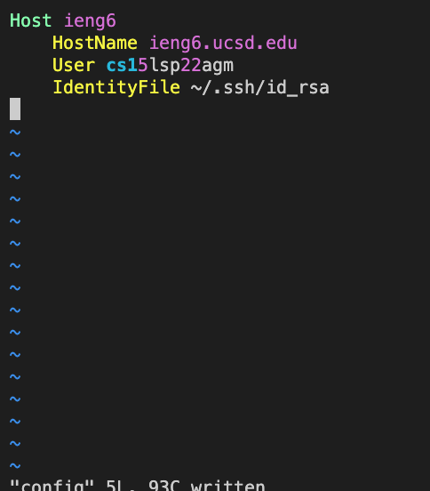

* This is what the file looks like and to edit I pressed `I`.

I used this command:

> `vim config`

into the terminal after being in `.ssh` to get into the file.

I log into my account using just the alias `ieng6`.

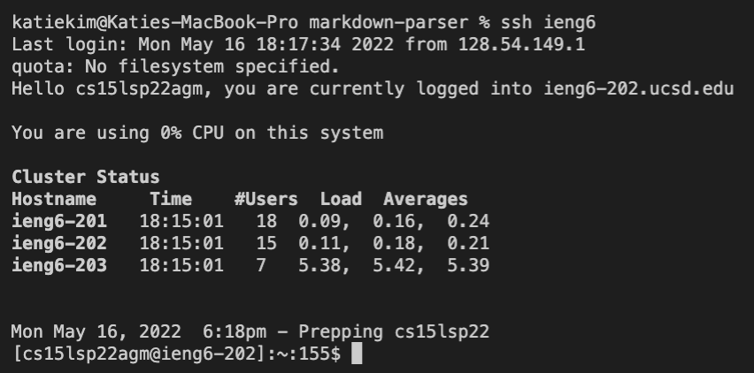

* This is what resulted in the terminal after using my alias to log in.

I can also copy files usinng `scp` by using just my alias `ieng6`.

* This is what shows in the terminal after using my alias to copy over a file.

---

## Setup Github Access from ieng6

I made a public key on Github for my personal computer.

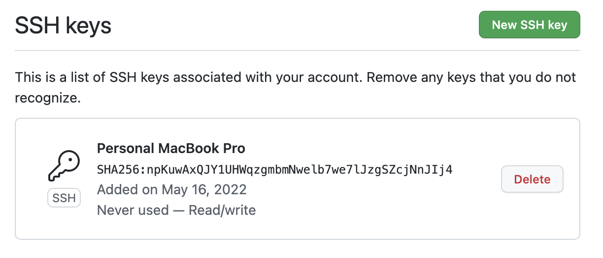

* This is what shows when my public key is created.

The private key stored on my user account is accessible through `.ssh`.

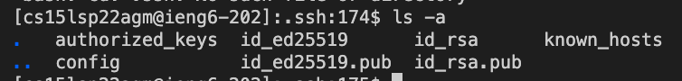

* This is the directory where my private key is located.

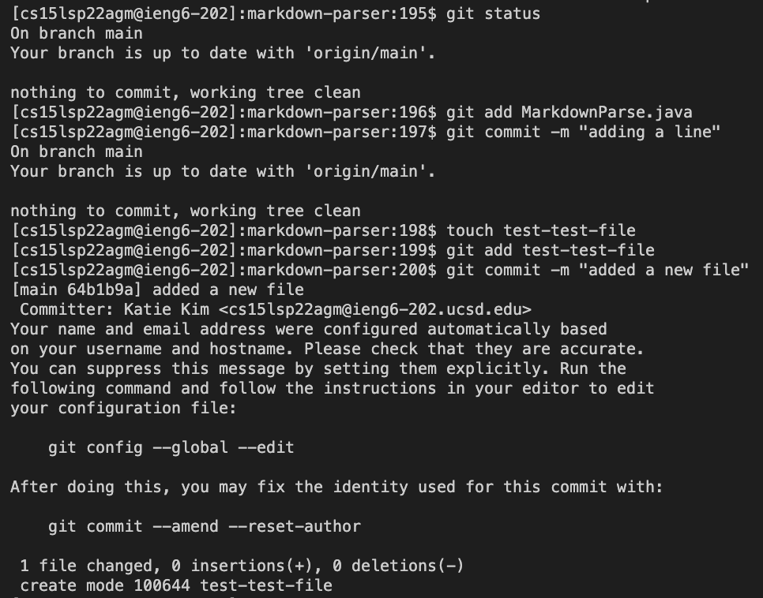

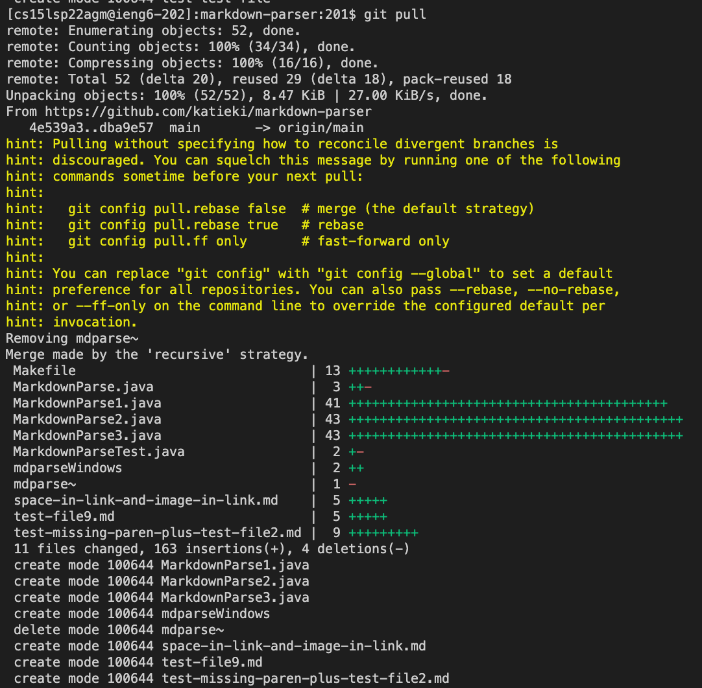

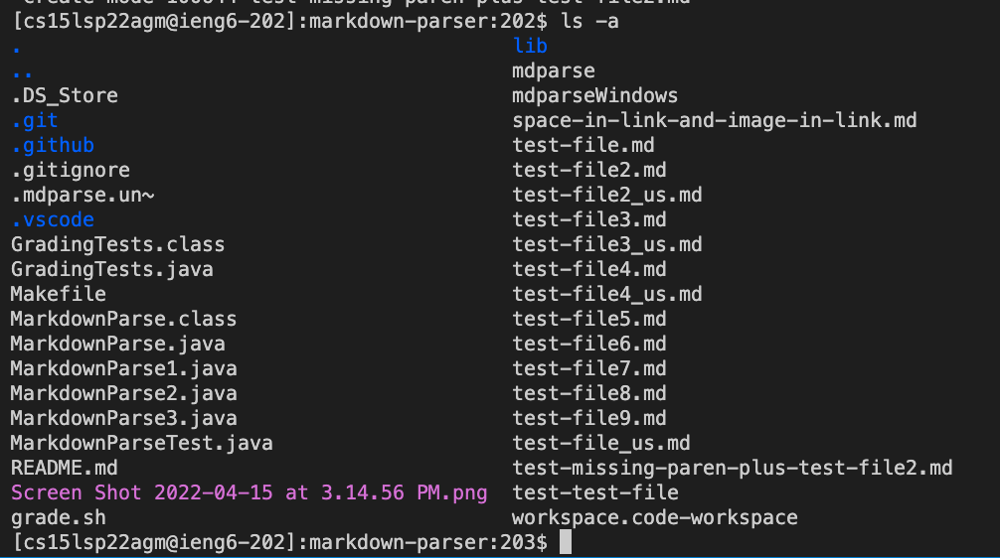

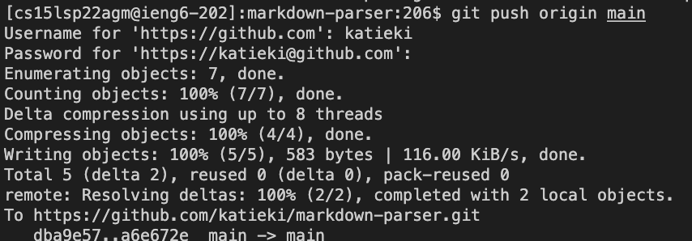

* This is what shows in the termial after running my `git` commands to commit and push a change to Github while logged into my ieng6 account.

My resulting commit is displayed on Github.

The link to it is below:

[Resulting Commit Link](https://github.com/katieki/markdown-parser/commit/64b1b9a834963db2cf49c68f01f6ada2f8deea61)

---

## Copy whole directories with `scp -r`

I copied my whole markdown-parse directory to my ieng6 account using `scp -r`.

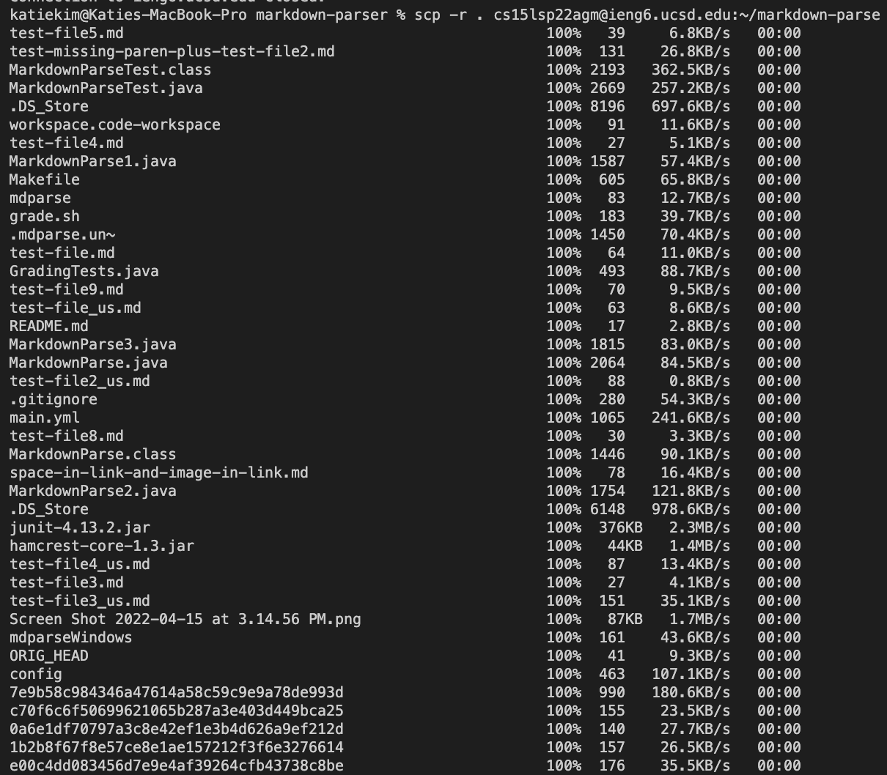

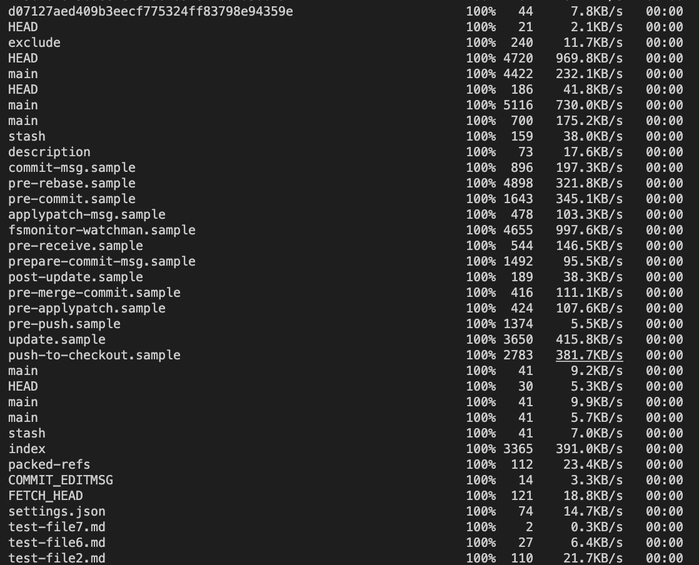

* This is what shows up in my terminal after running `scp -r`.

I am able to log into my ieng6 account and compile/run tests for my repository after copying the markdown-parse directory. 

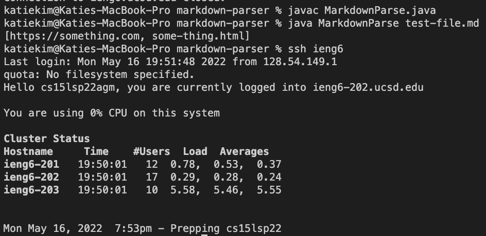

* This is what shows up in the terminal after running the tests in my repo and logging into my ieng6 account.

Just like how it shows in the last step of lab 1, we can combine arguments through `;`.

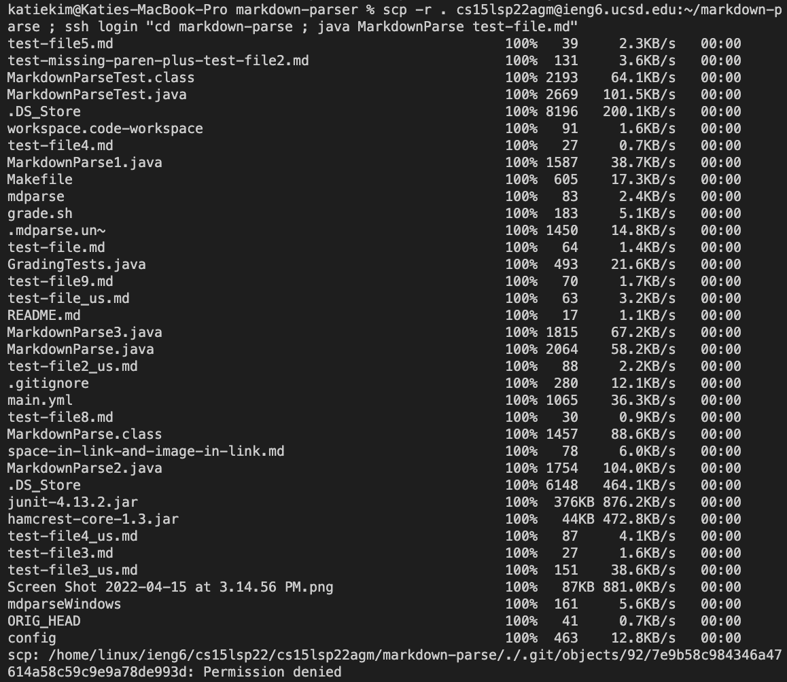

* This is my terminal after using `;` to combine several arguments.