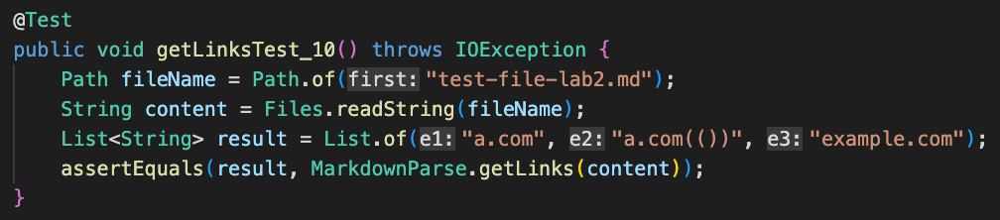
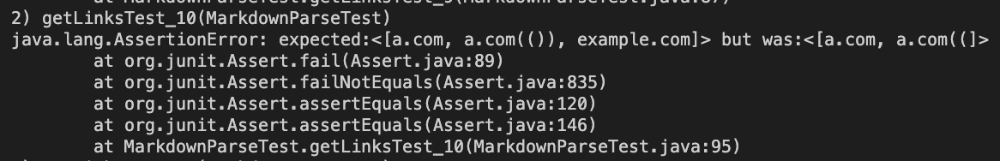
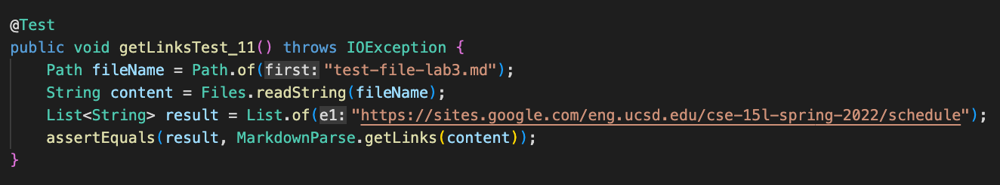
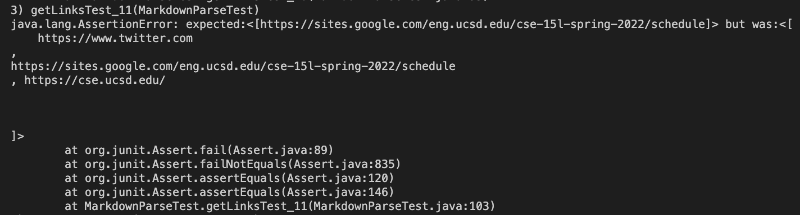
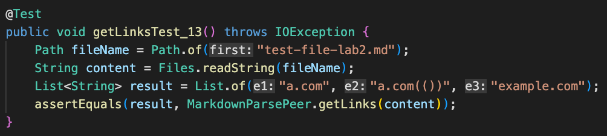
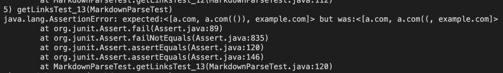
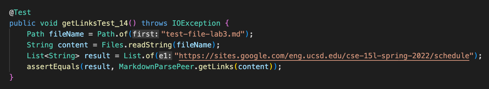

# **Week 8 Lab Report 4**

---

## MarkdownParse Repositories

This is the link to my MarkdownParse repository:

[My MarkdownParse Repo](https://github.com/katieki/markdown-parser)

This is the link to the MarkdownParse repository that I reviewed on week 8:

[Reviewed MarkdownParse Repo](https://github.com/henrigy/markdown-parser/blob/main/MarkdownParse.java)

---

## Snippets

I decided on what the tests should produce by going on the CommonMark demo site.

* From this output I decided that the tests should result to print out just:

    `'google.com`

* From this output I decided that the tests should result to print:

    `a.com, a.com(()), example.com` 

* From this output I decided that the tests should result to print:

    `https://sites.google.com/eng.ucsd.edu/cse-15l-spring-2022/schedule` 

---

## My MarkdownParse

* This is the test for the first snippet using my MarkdownParse.

* This is what the terminal looks like after running the JUnit test and the test didn't pass.

* This is the test for the second snippet using my MarkdownParse.

* This is what the terminal looks like after running the JUnit test and the test didn't pass.

* This is the test for the third snippet using my MarkdownParse.

* This is what the terminal looks like after running the JUnit test and the test didn't pass.

---

## Peer's MarkdownParse

* This is the test for the first snippet using my peer's MarkdownParse that I reviewed.

* This is what the terminal looks like after running the JUnit test and the test didn't pass.

* This is the test for the second snippet using my peer's MarkdownParse that I reviewed.

* This is what the terminal looks like after running the JUnit test and the test didn't pass.

* This is the test for the third snippet using my peer's MarkdownParse that I reviewed.

* This is what the terminal looks like after running the JUnit test and the test didn't pass.

---

## My MarkdownParse Review

For snippet one:

> I think there can be a small code change that will make the program work for snippet 1 and related cases that use inline code with backticks, because we just have to implement that there should not be any backticks involved in the code until the first "(". I have to make my code not return the link if there is a backtick involved before the open parenthesis.

For snippet two:

> I think there can be a small code change that will make the program work for snippet 2 and all related cases that work with nested parentheses, brackets, and escaped brackets, because I just have to make it so that the link returns as long as there is the same amount of open brackets and closed brackets before the open parenthesis. This applies to the parenthesis as well. The link should return if there is the same amount of open parenthesis as closed until the last closed parenthesis.

For snippet three:

> I think there can be a small code change that will make the program work for snippet 3 and all related cases that have new lines in brackets and parentheses. There just has to be a loop that will search beyond just the line the link starts at, as long as there is no line break. If there is a line break, the link is not returned.

---